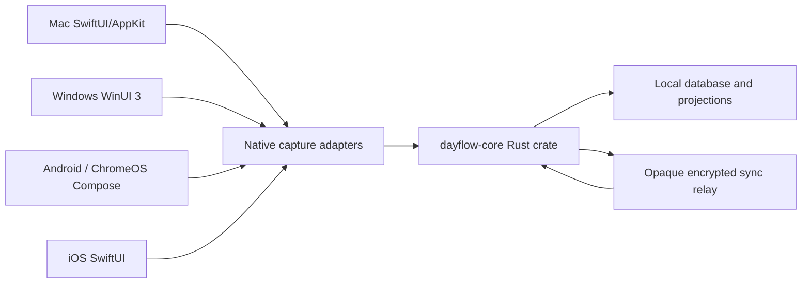

# Dayflow multi-device foundation

Dayflow is moving from a separate companion product to one product family with
native clients and a shared encrypted data model.

## Current implementation status

This branch delivers the first implementation slice:

- `shared-core/` is a portable Rust crate with event envelopes, encrypted event
  storage, deterministic projections, logical-day calculation, privacy gates,
  device-key wrapping, recovery kits, a retry-safe sync queue, UniFFI bindings,
  and a C ABI.
- `Dayflow/Dayflow/Core/MultiDevice/` contains the Mac Rust bridge, Keychain
  custody, migration markers, encrypted outbox, relay client, recovery-kit UI,
  live edit event writers, and projection import into the existing GRDB read
  model. Existing timeline, journal, and chat views remain readable while
  replay equivalence is established. Mac daily/journal changes emit priority,
  reflection, and setting events after successful local writes.
- The contracts in this directory make server and client behavior testable while
  the native Windows, Android/ChromeOS, and iOS shells move through their target
  SDK and device gates.
- Once an account, relay, and device key are configured, native clients make a
  guarded foreground reconnect automatically. Signed-out or incomplete setup
  stays local-only, and each client coalesces overlapping sync attempts.

The Cloudflare relay is implemented locally but still needs its canonical auth
binding and deployment gate. Non-Mac shells now contain connected account/auth,
encrypted sync, complete local projection/chat-context read models, journal,
priority, reflection, and shared-setting authoring, recovery, provider storage
and direct provider execution, and capture lifecycle source paths; their
platform SDKs are still required for build, packaging, and capture validation.

## Product shape

| Client | Native shell | Capture tier | Shared core boundary |
| --- | --- | --- | --- |
| Mac | SwiftUI/AppKit | ScreenCaptureKit display/app/window capture | Rust XCFramework / C ABI seam |
| Windows | WinUI 3 + C# | Windows.Graphics.Capture picker with visible system indication | C ABI / P/Invoke |
| Android | Kotlin + Jetpack Compose | Explicit MediaProjection sessions | UniFFI-generated Kotlin bindings |
| ChromeOS | Android app from Google Play | Android capture tier, Chromebook-aware UX | Same Kotlin bindings |
| iOS | SwiftUI | Explicit platform-permitted sessions plus in-app tracking | UniFFI-generated Swift bindings |

“Full capture” means the strongest platform-compliant mode. A client must expose
its actual capture state and permission limitations instead of presenting a
silent-capture promise that the operating system cannot honor.

## Architecture



Read the contracts in this order:

1. [Capability matrix](CAPABILITY_MATRIX.md)
2. [Rust core and FFI contract](CORE_CONTRACT.md)
3. [Encrypted sync protocol](SYNC_PROTOCOL.md)
4. [Recovery and device approval](RECOVERY_AND_DEVICE_APPROVAL.md)
5. [Migration and PWA deprecation](MIGRATION_AND_DEPRECATION.md)
6. [Delivery and acceptance gates](DELIVERY_GATES.md)
7. [Validation log](VALIDATION_LOG.md)
8. [Requirement audit](REQUIREMENT_AUDIT.md)

## Local verification

```bash
cargo test --manifest-path shared-core/Cargo.toml
cargo clippy --manifest-path shared-core/Cargo.toml --all-targets -- -D warnings
bash scripts/verify_dayflow_native_contracts.sh
bash scripts/verify_dayflow_setup.sh
xcodebuild -project Dayflow/Dayflow.xcodeproj -scheme Dayflow -configuration Debug -destination 'platform=macOS' build
# When both Apple Rust targets are installed:
bash scripts/build_dayflow_core_xcframework.sh
```

The Xcode command requires a macOS host with the required Xcode components and
the resolved Swift packages. Platform-specific spikes must be validated on their
native SDKs before they are described as shipped.
